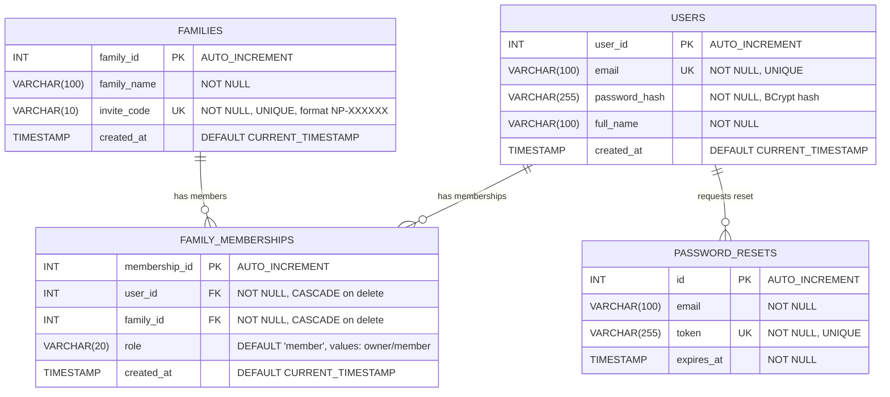

# NakPom — Database Documentation

This document describes the database schema, configuration, migration strategy, and connection architecture for the NakPom V1 MVP backend.

---

## 1. Overview

| Property | Value |
|----------|-------|
| **Engine** | MySQL 8.x |
| **Database Name** | `nakpom_db` |
| **Connection Pool** | HikariCP (bundled with Spring Boot) |
| **ORM** | Spring Data JPA / Hibernate |
| **Migration Tool** | Flyway |
| **Schema Strategy** | `hibernate.ddl-auto = validate` (Flyway manages schema; Hibernate only validates) |
| **Total Tables** | 4 |

---

## 2. Entity-Relationship Diagram



---

## 3. Table Specifications

### 3.1 `users`

Stores registered user accounts. Each user gets one row upon registration.

| Column | Type | Constraints | Description |
|--------|------|-------------|-------------|
| `user_id` | `INT` | `PRIMARY KEY`, `AUTO_INCREMENT` | Unique user identifier. |
| `email` | `VARCHAR(100)` | `NOT NULL`, `UNIQUE` | User's email address. Stored lowercase and trimmed. Used as the login credential. |
| `password_hash` | `VARCHAR(255)` | `NOT NULL` | BCrypt hash of the user's password. Produced with `gensalt(12)` (2¹² = 4096 iterations). The `$2a$12$...` format includes the algorithm version, cost factor, salt, and hash in a single string. |
| `full_name` | `VARCHAR(100)` | `NOT NULL` | User's display name. Supports Khmer Unicode characters (e.g., "សុខា មាន"). |
| `created_at` | `TIMESTAMP` | `DEFAULT CURRENT_TIMESTAMP` | Automatically set by MySQL when the row is inserted. |

**Indexes**:

| Index Name | Column(s) | Type | Purpose |
|------------|-----------|------|---------|
| `PRIMARY` | `user_id` | Primary Key | Row identification. |
| `email` | `email` | Unique | Enforces email uniqueness and speeds up login lookups (`findByEmail`). |
| `idx_email` | `email` | Secondary | Explicit index for email search performance. |

**JPA Entity**: `com.nakpom.features.auth.models.User`

---

### 3.2 `families`

Represents family circle spaces. The first family for every user is auto-created with the name "Krousa Me" during registration.

| Column | Type | Constraints | Description |
|--------|------|-------------|-------------|
| `family_id` | `INT` | `PRIMARY KEY`, `AUTO_INCREMENT` | Unique family identifier. |
| `family_name` | `VARCHAR(100)` | `NOT NULL` | Display name of the family space. Defaults to "Krousa Me" for the auto-created space. Users may create additional spaces in future sprints. |
| `invite_code` | `VARCHAR(10)` | `NOT NULL`, `UNIQUE` | A short, shareable code in format `NP-XXXXXX` (6 uppercase alphanumeric characters). Used by relatives to join the family circle. Generated using secure random characters, excluding ambiguous characters (0/O, 1/I). |
| `created_at` | `TIMESTAMP` | `DEFAULT CURRENT_TIMESTAMP` | Automatically set by MySQL when the row is inserted. |

**Indexes**:

| Index Name | Column(s) | Type | Purpose |
|------------|-----------|------|---------|
| `PRIMARY` | `family_id` | Primary Key | Row identification. |
| `invite_code` | `invite_code` | Unique | Enforces code uniqueness and speeds up `findByInviteCode` for the invite join flow. |
| `idx_invite_code` | `invite_code` | Secondary | Explicit index for invite code lookup performance. |

**JPA Entity**: `com.nakpom.features.auth.models.Family`

---

### 3.3 `family_memberships`

A many-to-many junction table linking users to families. This table acts as the **security wall** — a user can only view a family feed if they have a matching membership row.

| Column | Type | Constraints | Description |
|--------|------|-------------|-------------|
| `membership_id` | `INT` | `PRIMARY KEY`, `AUTO_INCREMENT` | Unique membership identifier. |
| `user_id` | `INT` | `NOT NULL`, `FOREIGN KEY → users(user_id) ON DELETE CASCADE` | The member. Cascading delete ensures memberships are removed when a user account is deleted. |
| `family_id` | `INT` | `NOT NULL`, `FOREIGN KEY → families(family_id) ON DELETE CASCADE` | The family space. Cascading delete ensures memberships are removed when a family is deleted. |
| `role` | `VARCHAR(20)` | `DEFAULT 'member'` | The user's role within this family. Values: `"owner"` (the creator), `"member"` (joined via invite code). |
| `created_at` | `TIMESTAMP` | `DEFAULT CURRENT_TIMESTAMP` | When the user joined this family. |

**Indexes & Constraints**:

| Index Name | Column(s) | Type | Purpose |
|------------|-----------|------|---------|
| `PRIMARY` | `membership_id` | Primary Key | Row identification. |
| `unique_user_family` | `(user_id, family_id)` | Unique Composite | Prevents a user from joining the same family twice. |
| `idx_user_id` | `user_id` | Secondary | Speeds up "find all families for this user" queries. |
| `idx_family_id` | `family_id` | Secondary | Speeds up "find all members of this family" queries. |

**Foreign Keys**:

| FK Column | References | On Delete | Rationale |
|-----------|------------|-----------|-----------|
| `user_id` | `users(user_id)` | `CASCADE` | If a user is deleted, all their memberships are automatically removed. |
| `family_id` | `families(family_id)` | `CASCADE` | If a family is deleted, all membership links are automatically cleaned up. |

**JPA Entity**: `com.nakpom.features.auth.models.FamilyMembership`

---

### 3.4 `password_resets`

Stores time-limited tokens for password reset flows. When a user requests a password reset, a token is generated and sent via SMTP (free transactional email services like Resend or Brevo). The token is validated against this table when the user submits their new password.

| Column | Type | Constraints | Description |
|--------|------|-------------|-------------|
| `id` | `INT` | `PRIMARY KEY`, `AUTO_INCREMENT` | Unique reset request identifier. |
| `email` | `VARCHAR(100)` | `NOT NULL` | The email address that requested the reset. Not a foreign key — allows resets for emails that may not yet be verified. |
| `token` | `VARCHAR(255)` | `NOT NULL`, `UNIQUE` | A cryptographically random, URL-safe token. Uniqueness enforced to prevent token collisions. |
| `expires_at` | `TIMESTAMP` | `NOT NULL` | Expiration time for the token. Tokens should be short-lived (e.g., 15–30 minutes) to limit the attack window. |

**Indexes**:

| Index Name | Column(s) | Type | Purpose |
|------------|-----------|------|---------|
| `PRIMARY` | `id` | Primary Key | Row identification. |
| `token` | `token` | Unique | Enforces uniqueness and enables fast token validation lookup. |
| `idx_token` | `token` | Secondary | Explicit index for rapid token lookup during the reset flow. |
| `idx_email` | `email` | Secondary | Enables cleanup of old tokens by email (`deleteByEmail`). |

**JPA Entity**: `com.nakpom.features.auth.models.PasswordReset`

---

## 4. Flyway Migrations

Flyway manages all schema changes. Hibernate is set to `ddl-auto: validate` — it verifies the schema matches the JPA entities at startup but never creates or modifies tables. All schema changes must go through versioned migration scripts.

| Version | File | Tables Created | Description |
|---------|------|----------------|-------------|
| V1 | `V1__Create_initial_tables.sql` | `users`, `families`, `family_memberships` | Core schema with foreign keys, unique constraints, and indexes. Also includes `CREATE DATABASE IF NOT EXISTS nakpom_db`. |
| V2 | `V2__Create_password_resets.sql` | `password_resets` | Token-based password reset infrastructure with indexed email and token columns. |

**Migration Location**: `src/main/resources/db/migration/`

**Naming Convention**: `V{number}__{description}.sql` (double underscore between version and description)

**Configuration** (from `application.yml`):
```yaml
spring:
  flyway:
    enabled: true
    baseline-on-migrate: true
    locations: classpath:db/migration
```

- `baseline-on-migrate: true` — allows Flyway to run on an existing database that wasn't previously managed by Flyway. It creates the `flyway_schema_history` tracking table on first run.

---

## 5. Connection Configuration

### 5.1 Data Source

Configured in `application.yml` with environment variable substitution from `.env`:

```yaml
spring:
  config:
    import: optional:file:.env[.properties]

  datasource:
    url: ${DB_URL:jdbc:mysql://localhost:3306/nakpom_db}
    username: ${DB_USERNAME}
    password: ${DB_PASSWORD}
    driver-class-name: com.mysql.cj.jdbc.Driver
```

- `spring.config.import` loads the `.env` file as a properties source. The `optional:` prefix prevents startup failure if the file is missing.
- `DB_URL` has a default fallback to localhost; `DB_USERNAME` and `DB_PASSWORD` are **required** (no defaults) to prevent accidental use of OS-level credentials.

### 5.2 HikariCP Connection Pool

```yaml
hikari:
  maximum-pool-size: 10
  minimum-idle: 5
  connection-timeout: 30000    # 30 seconds
  idle-timeout: 600000         # 10 minutes
  max-lifetime: 1800000        # 30 minutes
```

| Parameter | Value | Description |
|-----------|-------|-------------|
| `maximum-pool-size` | 10 | Maximum number of connections in the pool. Sized for a development/small production workload. |
| `minimum-idle` | 5 | Minimum idle connections maintained. Prevents cold-start latency on burst traffic. |
| `connection-timeout` | 30s | Maximum time to wait for a connection from the pool before throwing an exception. |
| `idle-timeout` | 10min | Maximum time a connection can sit idle before being retired. |
| `max-lifetime` | 30min | Maximum lifetime of a connection. Set below MySQL's `wait_timeout` (default 8h) to prevent stale connections. |

### 5.3 JPA / Hibernate

```yaml
jpa:
  hibernate:
    ddl-auto: validate
  show-sql: true
  properties:
    hibernate:
      dialect: org.hibernate.dialect.MySQLDialect
      format_sql: true
```

| Setting | Value | Description |
|---------|-------|-------------|
| `ddl-auto` | `validate` | Hibernate validates the schema against entity definitions at startup but never modifies it. Schema changes go through Flyway only. |
| `show-sql` | `true` | Logs all SQL statements (development aid). Disable in production. |
| `dialect` | `MySQLDialect` | Tells Hibernate to generate MySQL-specific SQL. |
| `format_sql` | `true` | Pretty-prints SQL in logs for readability. |

---

## 6. JPA Entity ↔ Table Mapping

| Entity Class | Table | ID Strategy | Key Annotations |
|-------------|-------|-------------|-----------------|
| `User` | `users` | `IDENTITY` (auto-increment) | `@Column(unique=true)` on email, `@Column(updatable=false)` on createdAt |
| `Family` | `families` | `IDENTITY` | `@Column(unique=true)` on inviteCode |
| `FamilyMembership` | `family_memberships` | `IDENTITY` | `@UniqueConstraint(columnNames=["user_id","family_id"])` on table |
| `PasswordReset` | `password_resets` | `IDENTITY` | `@Column(unique=true)` on token |

**Kotlin JPA Plugins** (from `build.gradle.kts`):
- `kotlin("plugin.jpa")` — Generates no-arg constructors required by Hibernate for entity instantiation.
- `kotlin("plugin.allopen")` — Opens entity classes for Hibernate proxying (Kotlin classes are `final` by default).

---

## 7. Security Considerations

| Concern | Implementation |
|---------|---------------|
| **Password Storage** | BCrypt hash with cost factor 12 (2¹² iterations). Never store plaintext. |
| **Data Isolation** | Family feeds are gated by `family_memberships` — a user without a membership row for a given `family_id` cannot access that family's data. |
| **Cascading Deletes** | `ON DELETE CASCADE` on both FKs in `family_memberships` ensures no orphan records if a user or family is removed. |
| **Credential Exposure** | `.env` is in `.gitignore`. `DB_USERNAME`/`DB_PASSWORD` have no defaults to prevent fallback to OS credentials. |
| **Reset Token Lifetime** | `expires_at` column enforces time-limited tokens. Application logic must reject expired tokens. |
| **Invite Code Entropy** | 6-character alphanumeric codes provide 2.1 billion combinations, making brute-force guessing impractical. |
