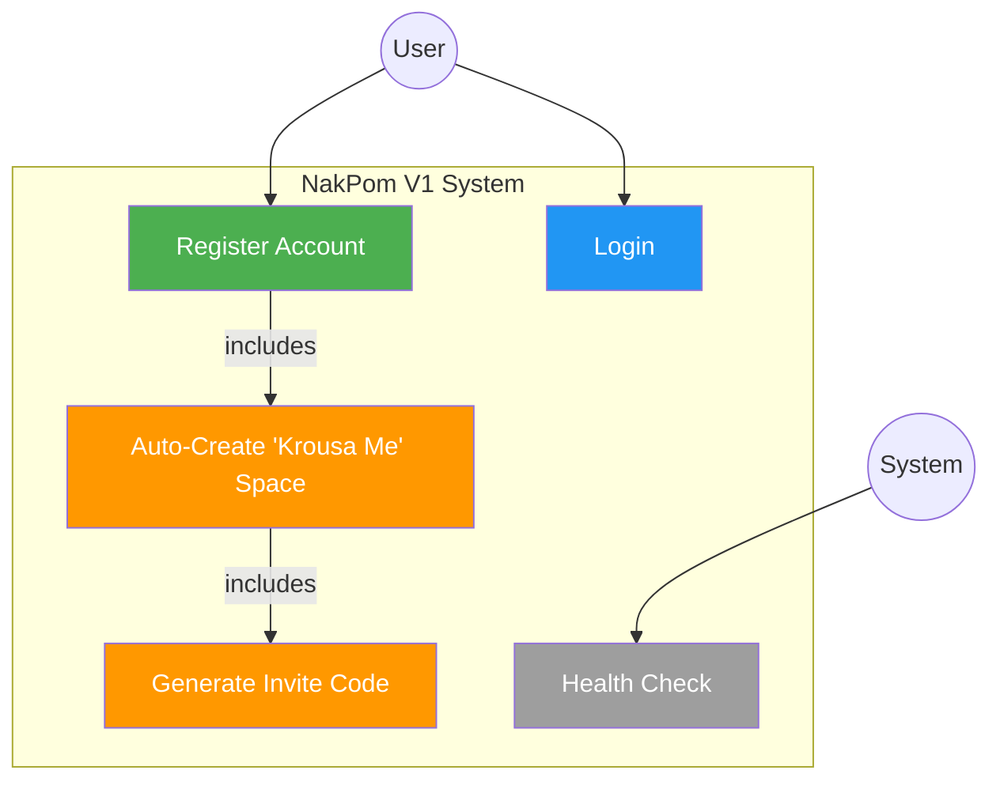
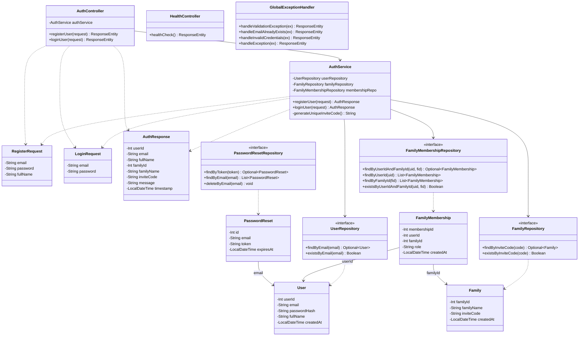
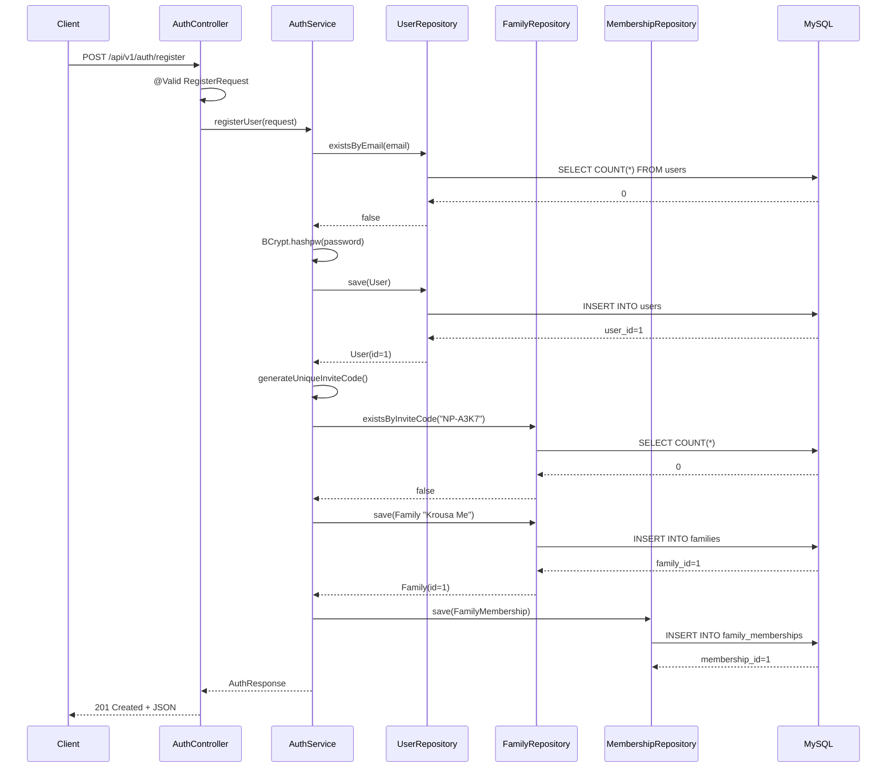
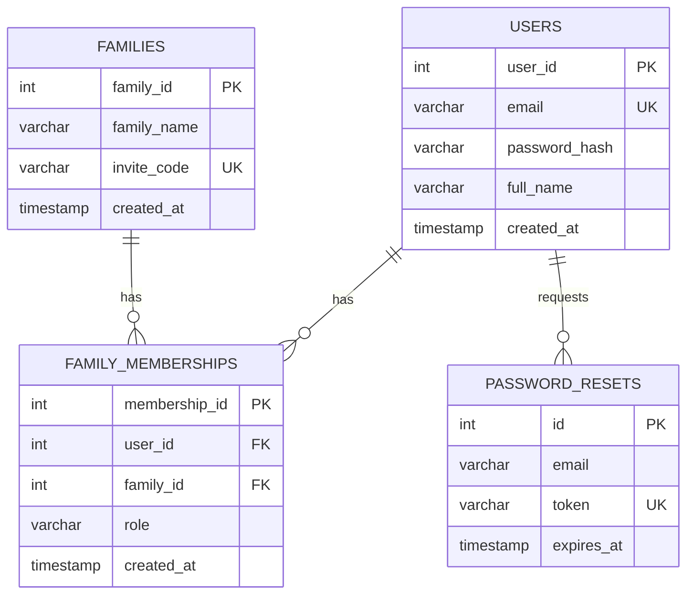

# NakPom Sprint 1 — UML Diagrams

## 1. Use Case Diagram

### Use Case Descriptions

| Use Case | Actor | Description |
|----------|-------|-------------|
| Register Account | User | User submits email, password, and full name. System validates, hashes password, and creates account. |
| Auto-Create "Krousa Me" | System | Triggered on registration. Creates a private family space and links the user as owner. |
| Generate Invite Code | System | Creates a unique NP-XXXX code for the new family space. |
| Login | User | User authenticates with email and password. Returns user and family details. |
| Health Check | System | Verifies backend is running and responsive. |

---

## 2. Class Diagram

---

## 3. Sequence Diagram — Registration Flow

---

## 4. ER Diagram

