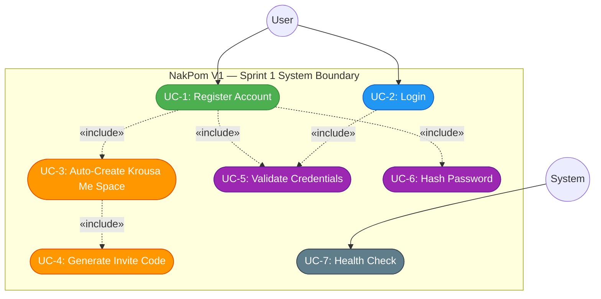
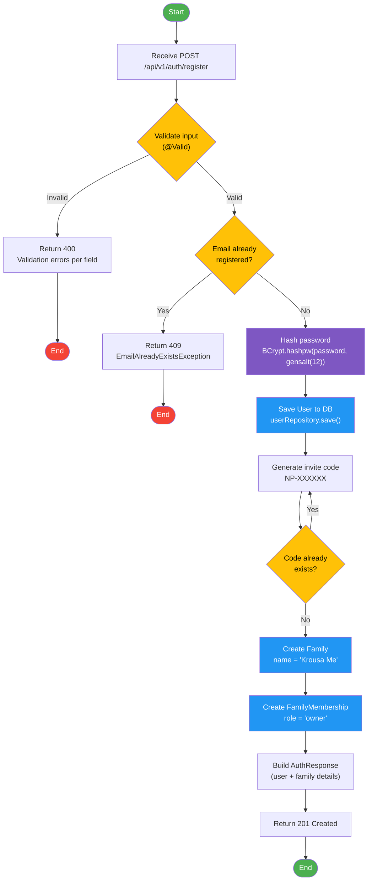
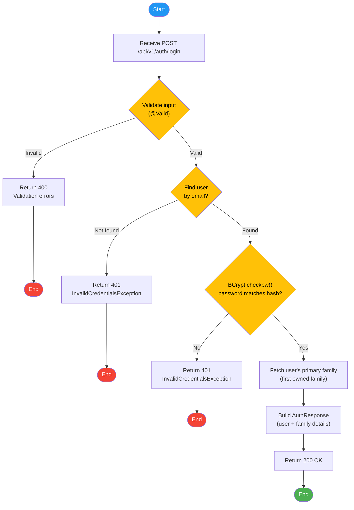
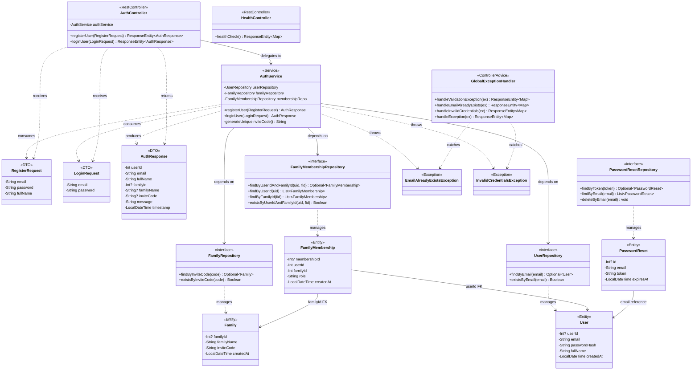
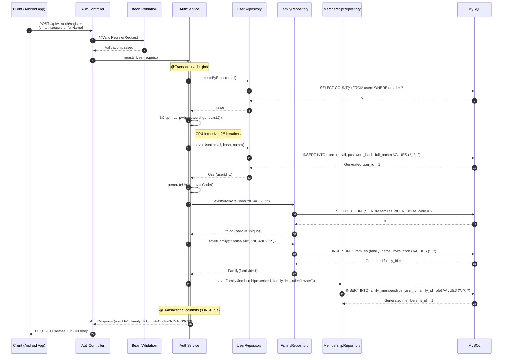
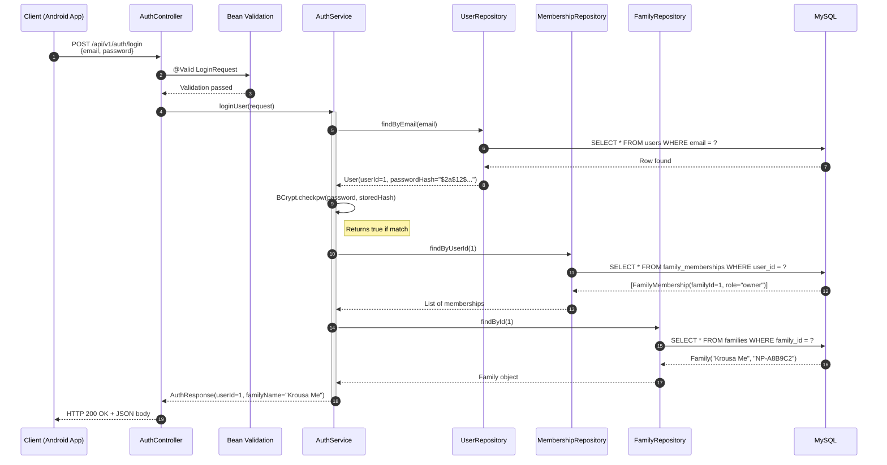
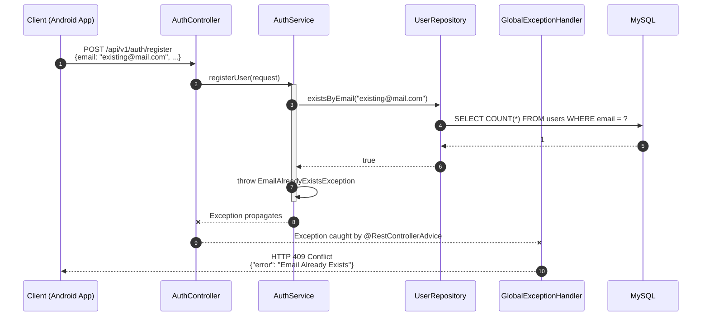
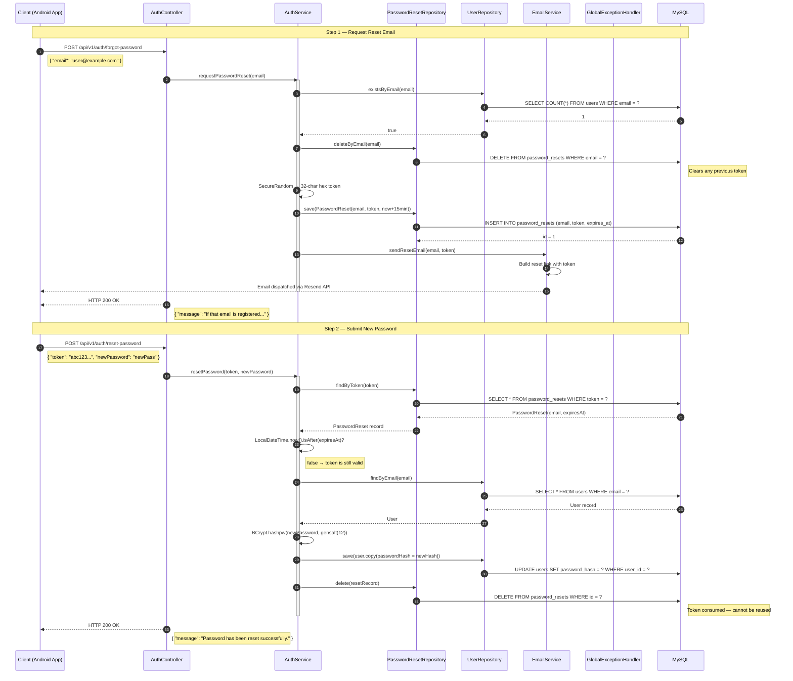
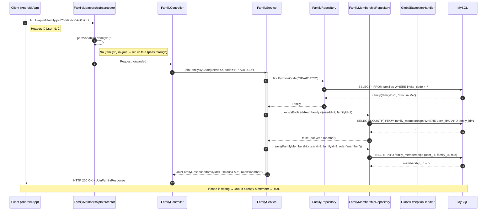
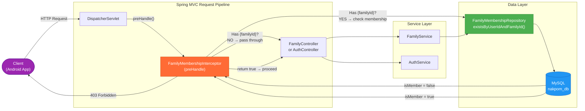

# NakPom — UML Diagrams (Sprint 1 & Sprint 2)

This document contains the four required UML diagrams for Sprint 1: **Use Case**, **Activity**, **Class**, and **Sequence** diagrams. Each diagram is accompanied by a detailed description explaining the design decisions, actors, and interactions modelled.

---

## 1. Use Case Diagram

### Diagram

### Description

**Purpose**: Maps the functional requirements of Sprint 1 to actors and their goals within the system boundary.

**Actors**:

| Actor | Type | Description |
|-------|------|-------------|
| **User** | Primary | A Cambodian citizen interacting with the NakPom mobile app. Initiates registration and login. |
| **System** | Supporting | The NakPom backend server. Performs automated health monitoring and internal processes. |

**Use Cases**:

| ID | Use Case | Actor | Pre-condition | Post-condition | Description |
|----|----------|-------|---------------|----------------|-------------|
| UC-1 | Register Account | User | User has no existing account with the given email. | Account created, "Krousa Me" family space exists, user linked as owner. | The user submits email, password, and full name. The system validates the input fields using Bean Validation constraints (`@Email`, `@NotBlank`, `@Size`), checks that the email is not already registered, hashes the password using BCrypt with a cost factor of 12, persists the User record, and triggers the automatic creation of the default family space. Returns a 201 response with user and family details. |
| UC-2 | Login | User | User has a registered account. | User is authenticated and receives account details. | The user submits email and password. The system looks up the account by email, verifies the password against the stored BCrypt hash, and returns the user's profile along with their primary family information. Returns 200 on success, 401 on failure. |
| UC-3 | Auto-Create "Krousa Me" | System | User record has just been persisted in the database. | A Family record named "Krousa Me" exists, and a FamilyMembership record links the user to it with role "owner". | This is an internal use case included by UC-1. It runs within the same `@Transactional` boundary as registration. The system generates a unique invite code, creates the Family entity, and inserts the ownership membership link. If any step fails, the entire registration transaction rolls back. |
| UC-4 | Generate Invite Code | System | A new family is being created. | A unique `NP-XXXXXX` code is assigned to the family. | Generates a secure random 6-character uppercase alphanumeric code prefixed with `NP-`. The system checks for uniqueness against the `families` table and retries if a collision is detected (up to 10 attempts). The 6-character format provides over 2 billion possible combinations. |
| UC-5 | Validate Credentials | System | A registration or login request has been received. | Input is confirmed valid, or a 400/401 error is returned. | Shared validation logic. For registration: enforces email format, password length (6–128 chars), and name length (2–100 chars). For login: verifies the provided password matches the stored BCrypt hash. Invalid input returns structured error details per field. |
| UC-6 | Hash Password | System | A plaintext password has been validated. | A BCrypt hash string is produced. | Uses `BCrypt.hashpw()` with `gensalt(12)` to produce a salted, one-way hash. The cost factor of 12 means 2¹² = 4096 iterations, balancing security and performance. |
| UC-7 | Health Check | System | Server is running. | HTTP 200 returned with server status. | A monitoring endpoint at `GET /api/v1/health` that returns the service name, version, status, and current timestamp. Used by operations tooling to confirm the backend is alive. |

**Relationships**:
- UC-1 **«include»** UC-5, UC-6, UC-3 — Registration always validates, hashes, and creates the family space.
- UC-3 **«include»** UC-4 — Family creation always generates an invite code.
- UC-2 **«include»** UC-5 — Login always validates credentials.

---

## 2. Activity Diagram

### 2.1 Registration Activity

### 2.2 Login Activity

### Description

**Purpose**: Models the step-by-step flow of the two core Sprint 1 operations — Registration and Login — showing decision points, error paths, and the transactional boundary of the "Krousa Me" automator.

**Registration Flow (2.1)**:

The registration activity begins when the client sends a `POST /api/v1/auth/register` request with a JSON body containing `email`, `password`, and `fullName`. The flow passes through three decision gates:

1. **Input Validation** — Spring's `@Valid` annotation triggers Bean Validation on the `RegisterRequest` DTO. If any field fails (e.g., malformed email, password shorter than 6 characters), the `GlobalExceptionHandler` catches the `MethodArgumentNotValidException` and returns a 400 response with per-field error details. The request never reaches the service layer.

2. **Email Uniqueness** — The service queries `userRepository.existsByEmail()`. If the email is already taken, an `EmailAlreadyExistsException` is thrown, resulting in a 409 Conflict response.

3. **Invite Code Uniqueness** — After generating a random `NP-XXXXXX` code, the service checks `familyRepository.existsByInviteCode()`. On collision, it loops and regenerates (up to 10 attempts before falling back to an 8-character code).

The purple-highlighted step (password hashing) is a CPU-intensive operation using BCrypt with cost factor 12. The blue-highlighted steps (Save User, Create Family, Create Membership) all execute within a single `@Transactional` boundary — if any database write fails, all three are rolled back atomically.

**Login Flow (2.2)**:

The login activity is simpler with two decision gates (user existence and password verification). Importantly, both the "user not found" and "wrong password" paths return the same generic 401 error message (`"Invalid email or password"`). This is a deliberate security decision to prevent **user enumeration attacks** — an attacker cannot distinguish between a non-existent account and a wrong password.

---

## 3. Class Diagram

### Diagram

### Description

**Purpose**: Shows the static structure of the Sprint 1 codebase — all classes, their attributes, methods, stereotypes, and relationships.

**Architectural Layers**:

The class diagram follows a layered architecture with clear separation of concerns:

| Layer | Classes | Responsibility |
|-------|---------|---------------|
| **Routing** (Controller) | `AuthController`, `HealthController` | HTTP request mapping, input validation (`@Valid`), HTTP status codes. No business logic. |
| **Service** | `AuthService` | Core business rules: registration flow with "Krousa Me" auto-creation, login with BCrypt verification, invite code generation. Annotated with `@Transactional` for atomicity. |
| **Repository** | `UserRepository`, `FamilyRepository`, `FamilyMembershipRepository`, `PasswordResetRepository` | Data access interfaces extending Spring Data `JpaRepository`. Provide derived query methods. No implementation code — Spring generates the implementations at runtime. |
| **Model (Entity)** | `User`, `Family`, `FamilyMembership`, `PasswordReset` | JPA entities mapped to MySQL tables. Kotlin `data class` with the `kotlin-jpa` plugin for no-arg constructor generation. |
| **Model (DTO)** | `RegisterRequest`, `LoginRequest`, `AuthResponse` | Data Transfer Objects for API input/output. DTOs carry Bean Validation annotations and decouple the API contract from the persistence model. |
| **Exception** | `GlobalExceptionHandler`, `EmailAlreadyExistsException`, `InvalidCredentialsException` | Centralized error handling. The handler translates exceptions into structured JSON error responses with appropriate HTTP status codes. |

**Key Design Decisions**:

- **DTOs separate from Entities**: The `RegisterRequest` contains a plaintext `password` field, while the `User` entity stores `passwordHash`. This separation prevents accidental exposure of password hashes in API responses.
- **Repository interfaces only**: Spring Data JPA generates the implementation at runtime from method signatures. Custom queries like `findByEmail` are derived from naming conventions.
- **Nullable IDs**: Entity IDs are `Int?` (nullable) because they are database-generated. After `save()`, the ID is populated by Hibernate.
- **Exception hierarchy**: Custom exceptions extend `RuntimeException` so they propagate through Spring's `@Transactional` proxy and trigger rollback by default.

---

## 4. Sequence Diagram

### 4.1 Registration Sequence

### 4.2 Login Sequence

### 4.3 Registration Failure — Duplicate Email

### Description

**Purpose**: Models the runtime interactions between objects for the three key scenarios in Sprint 1 — successful registration, successful login, and registration failure due to duplicate email.

**Registration Sequence (4.1)**:

This is the most complex interaction in Sprint 1. The sequence shows **7 participants** collaborating across 3 architectural layers:

1. **Steps 1–3 (Validation)**: The controller receives the HTTP request and delegates input validation to Spring's Bean Validation framework. The `RegisterRequest` DTO is checked against `@Email`, `@NotBlank`, and `@Size` constraints before any business logic executes. If validation fails, a `MethodArgumentNotValidException` is thrown and the `GlobalExceptionHandler` returns a 400 response — this path is not shown to keep the diagram focused on the happy path.

2. **Steps 4–9 (Uniqueness + Hashing)**: The `AuthService` checks email uniqueness with a `SELECT COUNT(*)` query. If the email is available, it hashes the plaintext password using BCrypt. The `gensalt(12)` call produces a salt with 2¹² = 4096 iterations — this is deliberately CPU-intensive to make brute-force attacks impractical.

3. **Steps 10–13 (User Persistence)**: The `User` entity is saved to MySQL. Hibernate executes an `INSERT` and MySQL returns the auto-generated `user_id`. This ID is then used in subsequent steps.

4. **Steps 14–19 (Krousa Me Automator)**: The system generates a random `NP-XXXXXX` invite code, verifies its uniqueness, creates the Family record, and links the user via a FamilyMembership with role `"owner"`. All three `INSERT` operations (steps 11, 17, 19) are wrapped in a single `@Transactional` boundary — if the membership insert fails, the user and family inserts are rolled back too.

5. **Steps 20–21 (Response)**: The `AuthResponse` DTO is built with combined user and family data, and returned as a 201 Created response.

**Login Sequence (4.2)**:

The login flow involves fewer database operations:

1. **User lookup** (step 5): A `SELECT` by email. If no row is found, `InvalidCredentialsException` is thrown immediately.
2. **Password verification** (step 8): `BCrypt.checkpw()` compares the plaintext password against the stored hash. This is a constant-time comparison to prevent timing attacks.
3. **Family resolution** (steps 9–13): The service fetches the user's memberships and resolves the primary family (the first one where `role = "owner"`). This information is included in the login response so the Android app can navigate directly to the user's family space.

**Failure Sequence (4.3)**:

Demonstrates the exception propagation chain. When `EmailAlreadyExistsException` is thrown inside `AuthService`, it propagates up through `AuthController` and is intercepted by the `GlobalExceptionHandler` (annotated with `@RestControllerAdvice`). The handler translates the exception into a structured 409 Conflict JSON response. The same pattern applies to `InvalidCredentialsException` (→ 401) and `MethodArgumentNotValidException` (→ 400).

---

## Sprint 2 Diagrams

### 5. Sequence Diagram — Password Reset Full Flow

**Description**:

The password reset flow spans two separate HTTP requests:

1. **`POST /forgot-password`** — The user submits their email. The backend silently skips unknown emails (prevents enumeration), clears any existing token for that address, generates a new 32-character cryptographically random hex token, stores it with a 15-minute expiry, and dispatches the email via Resend. The response is always 200 OK regardless of whether the email is registered.

2. **`POST /reset-password`** — The user submits the token (from the email link) and their new password. The backend looks up the token, validates it is not expired, BCrypt-hashes the new password, updates the `users` table, and immediately deletes the token so it cannot be reused. If the token is missing or expired, `InvalidTokenException` is thrown → 400 Bad Request.

---

### 6. Sequence Diagram — Family Join via Invite Code

**Description**:

The join flow passes through the `FamilyMembershipInterceptor` first. Since `/join` has no `{familyId}` path variable, the interceptor detects an empty path variable map and passes the request through immediately without any membership check.

`FamilyService.joinFamilyByCode()` then performs two sequential checks:
1. **Invite code lookup** — `findByInviteCode()` queries the `families` table. If no match, `ResourceNotFoundException` → 404.
2. **Duplicate guard** — `existsByUserIdAndFamilyId()` checks if the user already has a row in `family_memberships` for that family. If yes, `MembershipAlreadyExistsException` → 409.

Only if both checks pass is a new membership row inserted with `role = "member"`.

---

### 7. Component Diagram — FamilyMembershipInterceptor in the Request Pipeline

**Description**:

The `FamilyMembershipInterceptor` sits between `DispatcherServlet` and the target controller. It implements Spring's `HandlerInterceptor.preHandle()` which runs **before** any controller method executes.

**Decision logic**:
- If the URL does not contain a `{familyId}` path variable (e.g. `/family/join`): the interceptor returns `true` immediately — the request flows to the controller untouched.
- If `{familyId}` is present: the interceptor reads `X-User-Id` from the request header and calls `FamilyMembershipRepository.existsByUserIdAndFamilyId()`. This is a single indexed `SELECT COUNT(*)` — one DB round-trip with negligible latency.
  - Member confirmed → return `true` → controller runs normally.
  - Not a member → write a 403 JSON response directly to `HttpServletResponse` and return `false` → controller never runs.

This design means **no family data is ever queried for unauthorized users** — the block happens at the earliest possible point in the pipeline.

